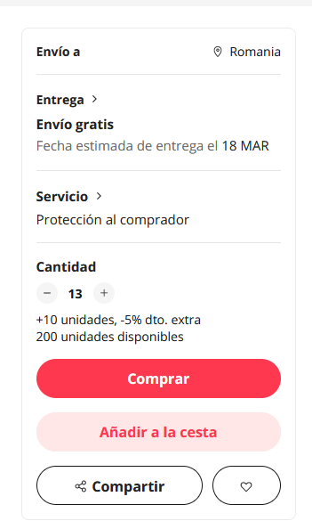

## Clickjacking

## Introducción

Este ataque se produce en la interfaz de un sitio web, haciendo que inconscientemente hagan *click* en enlaces maliciosos. Los atacantes incrustan sus enlaces maliciosos de forma camuflada o invisible en páginas legítimas, con el objetivo de que un usuario piense en hacer *click* a algo legítimo, cuando por detrás se produce una acción maliciosa , como robo de datos, toma de control de alguna acción...

## Causas comunes

El ataque de *Clickjacking* se produce a través de la etiqueta HTML `<iframe> `, esta etiqueta permite cargar una página web dentro de otra web (como por ejemplo un video de YouTube).

```html
<iframe src="url_del_contenido_a_mostrar" width="600" height="400"></iframe>
```

Las causas comunes son:
1. **Permisividad de iframes**: La capacidad de incrustar contenido de un sitio web en otro a través de iframes sin restricciones adecuadas es una causa fundamental de la vulnerabilidad al clickjacking. Si un sitio web permite que su contenido sea incrustado en otro sitio a través de un iframe, podría ser susceptible a ataques de clickjacking.
    
2. **Falta de implementación de cabeceras de seguridad HTTP**: Muchos sitios web no implementan cabeceras de seguridad HTTP como `X-Frame-Options` o `Content-Security-Policy` que pueden prevenir que sus páginas sean incrustadas en otros sitios. La cabecera `X-Frame-Options` puede configurarse para `DENY` (negar), lo que impide que la página sea mostrada en un iframe, o `SAMEORIGIN`, permitiendo que solo el mismo origen pueda incrustar la página. La política de seguridad de contenido (CSP) también puede usarse para restringir cómo y dónde se pueden cargar los recursos, incluyendo iframes.
    
3. **Falta de conocimiento o descuido en la seguridad web**: La falta de conciencia sobre los riesgos de seguridad, como el clickjacking, puede llevar a los desarrolladores a no tomar las precauciones necesarias durante el diseño e implementación de sus sitios web. Esto incluye no solo la falta de cabeceras de seguridad, sino también el descuido en las prácticas de codificación segura.
4. **Navegadores antiguos o sin actualizar**: Los navegadores que no están actualizados pueden no soportar las últimas cabeceras de seguridad o tener implementaciones defectuosas de políticas de seguridad, lo que los hace más vulnerables a varias formas de ataques, incluido el clickjacking.

Este tipo de ataque no solo se produce en la web, también se produce en dispositivos móviles, como el caso del malware **Svpeng** , que utilizaba *clickjacking* para robar datos bancarios de los teléfonos móviles. Este malware simulaba pantallas falsas, pero realmente los *clicks* iban hacia una pantalla invisible superpuesta en la que se acababa realizando alguna acción de forma incosciente.
Este ataque se puede usar para dar "likes" falsos, seguir a usuarios sin saberlo, pedir en Amazon sin saberlo... o mas graves como el robo de credenciales de bancos, el caso es que secuestra el *click* de un usuario para realizar una acción maliciosa.


## Tipos

Algunos tipos recopilados de [ehcGroup](https://blog.ehcgroup.io/2021/02/10/16/45/18/10630/clickjacking-definicion-y-ejemplo-de-defensa-y-ataque/hacking/ehacking/) son:
- **Likejacking**: este tipo de ataque tiene como objetivo captar los clics de los usuarios y redirigirlos a ” Me gusta” en una página de Facebook u otras redes sociales.
- **Cookiejacking**: en este caso, se lleva al usuario a interactuar con un elemento de la interfaz de usuario, por ejemplo, a través de arrastrar y soltar, y para proporcionar al atacante las cookies almacenadas en su navegador. De esta manera, el atacante podría realizar acciones en el sitio web objetivo en nombre del usuario.
- **Filejacking**: con este tipo de ataque, el usuario permite al atacante acceder a su sistema de archivos local y tomar archivos.
- **Cursorjacking**: esta técnica cambia la posición del cursor a un lugar diferente de donde el usuario lo percibe. De esta forma, el usuario cree que está realizando una acción mientras en realidad está realizando otra.
- **Ataques al administrador de contraseñas**: este tipo de ataque tiene como objetivo engañar a los administradores de contraseñas para que aprovechen su funcionalidad de autocompletar.


## Pasos de explotación

Para este tipo de ataque, el atacante prepara una página web maliciosa, esta página web contiene un *iframe* con una página web legítima sobre la que se desea realizar acciones maliciosas. 
El *iframe* se hace invisible con *CSS* o *JS* y se superpone, cuando un usuario realiza una acción sobre la página maliciosa, realmente esta *clickando* en un servicio légitimo y realizando acciones maliciosas sin saberlo , por ejemplo puedes pensar que estas jugando a un juego de cartas, pero realmente estas haciendo pedidos a través de un *iframe* invisible con una web de una tienda.

El clickjacking permite a los hackers insertar una capa de interfaz de usuario invisible entre la yema del dedo y el contenido que se muestra en la pantalla del dispositivo.

Un ejemplo sería algo así:

Esta página web es la web maliciosa, esta tienta al usuario a dar clicks en distintos lugares, sin embargo, esta web maliciosa contiene una etiqueta `<iframe>` invisible con una página web légitima:

```html
<!DOCTYPE html>
<html lang="es">
<head>
    <meta charset="UTF-8">
    <title>Ataque Clickjacking - Juego de Cartas</title>
    <style>
        /* Hace el iframe completamente transparente */
        iframe {
            position: absolute;
            width: 400px; /* Ajusta al tamaño del elemento que se quiere clickar */
            height: 200px; /* Ajusta al tamaño del elemento que se quiere clickar */
            opacity: 0; /* Hace el iframe invisible */
            z-index: 10; /* Asegura que el iframe esté por encima del otro contenido */
        }
        /* Estiliza la página para que parezca un juego  */
        .fake-game {
            position: relative;
            width: 400px;
            height: 200px;
         /* ... */
        }
    </style>
</head>
<body>

<div class="fake-game">Haz clic para jugar</div>
<iframe src="https://tienda-legitima.com/pedido?productoId=123" frameborder="0"></iframe>

</body>
</html>

```

Cuando un usuario haga *click* en alguno de los "regalos", realmente estará haciendo *click* en el botón de comprar de esta otra web, contenida en el iframe transparente:




## Implicaciones

Las implicaciones dependen del tipo de clickjacking, pueden ser leves, como dar "Me gusta" a un post sin saberlo, o graves, como filtrar credenciales o accesos a servicios bancarios...instalación de malware...

## Mitigación

- **Uso de la Cabecera HTTP `X-Frame-Options`**: Esta cabecera permite a los propietarios de sitios web controlar si su contenido puede ser incrustado en iframes de otros sitios. Las opciones más comunes son `DENY`, que bloquea cualquier incrustación; `SAMEORIGIN`, que solo permite la incrustación dentro del mismo dominio; y `ALLOW-FROM`, que especifica dominios permitidos.
    
- **Implementación de Políticas de Seguridad de Contenido (CSP)**: CSP es una capa de seguridad adicional que ayuda a detectar y mitigar ciertos tipos de ataques, incluidos los ataques de inyección de contenido como el clickjacking. Mediante la definición de una directiva `frame-ancestors` en CSP, los desarrolladores pueden controlar qué sitios pueden incrustar su contenido.
   ```html
    Content-Security-Policy: frame-ancestors <fuente>;
    Content-Security-Policy: frame-ancestors <lista de fuentes separadas por espacios>;
      ``` 
    
- **Uso de Técnicas de Verificación de Interacción del Usuario**: Implementar mecanismos que requieran una interacción más compleja que un simple clic (como arrastrar y soltar o teclear una secuencia de teclas) puede ayudar a mitigar los ataques de clickjacking, ya que estos mecanismos son más difíciles de replicar a través de iframes transparentes.
    