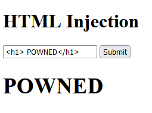
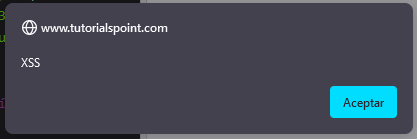

## Inyección de HTML

### Introducción

Esta vulnerabilidad se basa en la inyección de código HTML malicioso, el navegador normalmente no puede distinguir entre el código legítimo de un sitio web y un código malicioso. Si una página web utiliza el input de un usuario confiando en el input , para mostrar algún tipo de contenido HTML y no sanitiza la entrada correctamente, lo mas posible es que nos encontremos ante un HTML Injection.

---
### Causas Comúnes

Normalmente la causa mas común es el mal desarrollo de la parte del cliente de una web (Frontend) , el cliente nunca debe fiarse de la entrada del usuario, hay un dicho en la ciberseguridad y el concepto de desarrollo seguro que dice:  *"Todos los usuarios son hackers hasta que se demuestre lo contrario."*
Este dicho pretende hacer alusión a la mala práctica de los desarrolladores de confiar en el input del usuario. Pues se debe desarrollar pensando que todos intentarán vulnerar el programa.
Un ejemplo de un código vulnerable:

```HTML
<!DOCTYPE html>
<html>
<head>
    <title>Hello, World!</title>
    <link rel="stylesheet" href="styles.css" />
</head>
<body>
    <h1 class="title">HTML Injection</h1>
    <input type="text" placeholder="Enter your name..."/>
    <button>Submit</button>
    <h3></h3>

    <script>
      const input = document.querySelector("input");
      const target = document.querySelector("h3");
      const button = document.querySelector("button");
      
      button.addEventListener("click", () => {
        target.innerHTML = input.value; // Aquí se produce la inyección HTML
      });
    </script>
</body>
</html>

```

El uso de la etiqueta `.innerHTML` es muy propensa a esta vulnerabilidad, ya que permite que el navegador procese la entrada del usuario como código HTML.
Un input malicioso podría ser este:

```HTML
<h1>POWNED</h1>
```



En este ejemplo vemos como el navegador procesa la etiqueta de encabezado `<h1>` como HTML , y no como texto, este ejemplo a nivel de seguridad puede pensarse que solo puede acontecer un defacement, pero existen muchas otras vulnerabilidades que se pueden derivar de un HTMLi.
Por ejemplo si nuestro input malicioso fuese:

``` html
<script> alert("XSS")</script>
```
En este caso el navegador interpretaría la etiqueta ` <script>` como código légtimo de la web, lo que puede llevar por ejemplo a un ataque **XSS**.



### Tipos
- #### Reflected HTML Injection
     - La característica principal de este tipo de HTMLi es que el código malicioso no se almacena en el servidor (no tiene persistencia), si no que se produce cuando se ejecutan ciertas acciones, como un enlace malicioso, o una petición HTTP mal sanitizada.
     - Un ejemplo de Reflected HTMLi a través de una petición GET mal implementada es una web que tiene en la ruta un *query param* del estilo `page/user?name=input` , la página podría usar este parámetro de forma no sanitizada para renderizar algún componente en la página, exponiendose a un HTMLi si el usuario introdujese un input malicioso como hemos visto anteriormente.
     - Incluso si la petición cambiase el input a otro tipo de codificación, como* Url encoded*, o usase por ejemplo *htmlspecialchars()* (es una función en PHP que convierte ciertos carácteres peligrosos en entidades HTML, ej: "<" se convertiría en  "&lt" ) podría seguir siendo vulnerable si codificasemos nuestro payload en una codifiación adecuada (Url encoded o UTF-7 en estos casos).
- ### Stored HTML Injection
     - A diferencia del Reflected HTMLi, este tipo de vulnerabilidad si tiene persistencia, pudiendo derivar a otros tipos de ataques, como un CSRF, Defacement, XSS. La persistencia que obtiene el código injectado viene de que el servidor web guarda el input introducido y este código se renderiza cada vez que se accede al componente infectado.
     - Por ejemplo una sección de comentarios en un e-Commerce podría ser vulnerable a un Stored HTMLi si no sanitiza correctamente los comentarios de un producto. Cada vez que un usuario accediese a los comentarios de ese producto, el código malicioso se renderizaría .

## Pasos para la explotación
Hablaremos de explotación manual, para tratar de descubrir en un sitio web este tipo de vulnerabilidad, deberemos buscar los inputs cuyo valor parece que se renderiza en alguna parte de la web. Por ejemplo si nos encontramos con un input de comentarios, podemos ir probando con etiquetas HTML:
`<h1>testing</h1>`
Si vemos que se aplica algún tipo de sanitización o expresión regular, podemos intentar ver el código de la web con las herramientas de desarrollador del navegador a ver si encontramos pistas sobre como se implementa la sanitización, para tratar de burlarla.
	 
Si conseguimos que la página web renderice nuestro input malicioso simple, podemos tratar de pasar a construir scripts HTML mas sofisticados, por ejemplo un formulario malicioso con estilos *CSS* en linea para camuflarlo en la web, en el que le pidamos datos sensibles a los usuarios y que podemos enviar a nuestro servidor usando *JavaScript*, o más simple incluso, utilizando etiquetas como *prompt()* para detener el flujo de la web hasta que el usuario ingrese algo que le pidamos .
En cualquier caso, tanto el navegador como el usuario podrían pensar que el código es légitimo de la web y darle su confianza.

También podríamos ir probando distintos inputs en distintas codificaciones en URLS de la web, observando como procesa los inputs.
``` html
http://www.example.com/search?query=<html><script>alert('Vulnerable to HTML Injection!');</script></html>
```


## Mitigación

La única mitigación posible es el desarrollo seguro, nunca fiarse del input del usuario, desde mi experiencia como desarrollador, usar frameworks de desarrollo suele ser más seguro que desarrollar páginas con HTML puro, ya que algunos frameworks como React JS, sanitizan las entradas por defecto evitando estos ataques con su sintaxis *.jsx*.
Además se pueden implementar expresiones regulares para filtrar carácteres peligrosos como los de las etiquetas HTML *<></>*. 
Es importante que se valide la entrada tanto en el Frontend (cliente) (DOM based HTMLi) como en el Backend (servidor), ya que el código del Frontend es accesible para todos los usuarios, y este podría ser modificado para evitar la sanitización de un input en concreto, o la petición en la que se envie el input al Backend podría ser interceptada con un *Proxy* como [BurpSuite](https://portswigger.net/burp) para saltarse el control si esta solo implementado en  el cliente .
Otra posible mitigación es estableciendo un CSP robusto y eficaz, un CSP **(Content Security Policy)** es un conjunto de medidas de seguridad que se implementa a través de un encabezado HTTP `Content-Security-Policy` permite a los administradores de los sitios webs mitigar o restringir ciertas funcionalidades, por ejemplo puede definir que dominios pueden cargar ciertos recursos (como imágenes). 