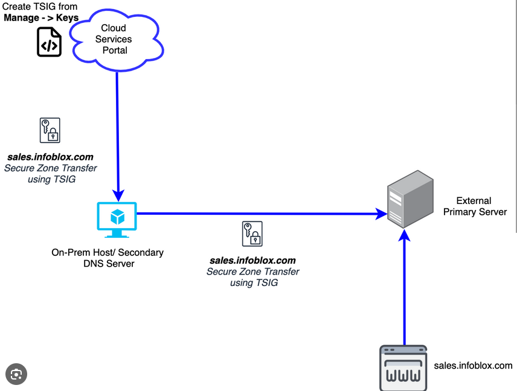
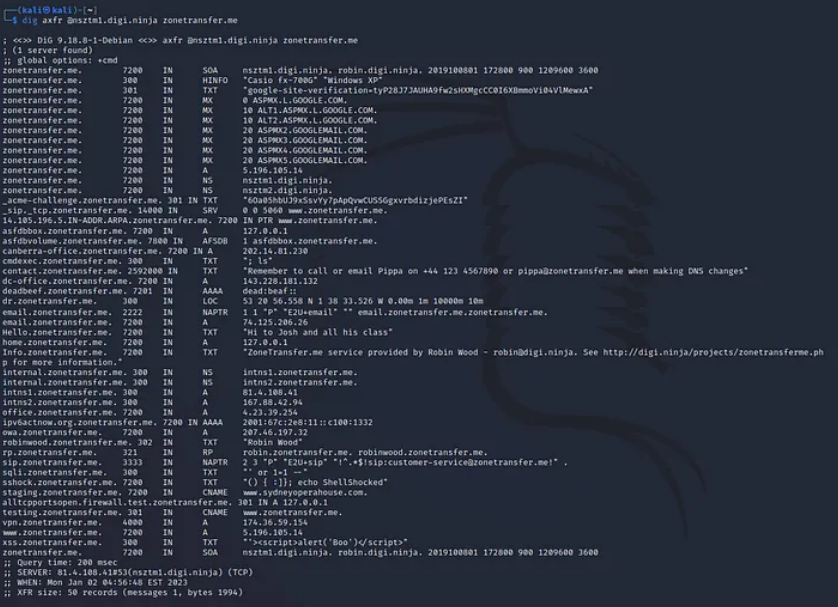

## Ataque de Transferencia de Zona DNS

## Introducción

Para entender este tipo de ataque, hay que entender ciertos aspectos. 
###### Servidor DNS
Un DNS es un tipo de servidor/sistema que se encarga de traducir un nombre de dominio a direcciones IP y viceversa, por ejemplo para acceder a *Google.com*, las personas  nos acordamos del dominio, pero realmente el ordenador necesita la IP , por ejemplo  **142.251.215.238**. 
El servidor DNS se encarga de esto, de a partir de un dominio fácil para los humanos, obtener su IP para poder navegar y realizar peticiones.
###### Zonas DNS
Una zona DNS es un espacio de un DNS que esta reservado a una organización, este espacio contiene información como direcciones IP, registros, servidores... 
Por ejemplo la zona de Google puede contener datos como este:
(google.com./142.251.215.238)

##### Transferencia de Zona DNS
Esta técnica se utiliza para transferir información de una Zona DNS de un servidor DNS autoritativo (este contiene la información DNS mas actualizada de un dominio) a otro servidor DNS. 

##### Ataque de Transferencia de Zona DNS
En este tipo de ataque, un atacante engaña a un servidor DNS autoritativo para hacerle creer que es otro servidor DNS para tratar de que le realice una *Transferencia de zona*, si el servidor autoritativo esta mal configurado y el atacante consigue la transferencia, esto permite al atacante acceder a cierta información sensible, como la estructura de red del dominio, hosts, direcciones IP... 
Con esta información el atacante puede realizar ataques más dirigidos.

## Causas comunes
1. **Configuración Incorrecta del Servidor DNS:** La causa más común de estos ataques es una configuración inadecuada de los servidores DNS autoritativos, que permite transferencias de zona a cualquier solicitante sin autenticación.
    
2. **Falta de Seguridad en la Comunicación:** La ausencia de medidas de seguridad, como la autenticación mediante TSIG (Transaction Signature) para validar las solicitudes de transferencia de zona, facilita la explotación por parte de atacantes.
   
    
3. **Uso de Software Desactualizado:** Los servidores DNS que ejecutan versiones de software desactualizadas pueden tener vulnerabilidades conocidas que facilitan este tipo de ataques.
    

### Tipos
Nos encontramos con dos principales tipos de ataque de transferencia DNS basados en el método que se utiliza para la transferencia, ****AXFR**** (Transferencia Completa de Zona) e ****IXFR**** (Transferencia Incremental de Zona).

- AXFR: es un tipo de transferencia de zona DNS que replica toda la zona DNS desde el servidor maestro al servidor esclavista. Esto se hace cuando el servidor esclavo se está configurando o cuando el servidor maestro se ha actualizado con nuevos registros de recursos DNS.
  Es una operación todo o nada que transfiere la totalidad de la zona DNS cada vez que se realiza.
- IXFR: permite la transferencia de solo los cambios realizados en la zona DNS desde la última transferencia, en lugar de transferir toda la zona. Esto reduce la cantidad de datos transmitidos y el tiempo necesario para la actualización, haciendo que la sincronización entre servidores DNS sea más eficiente. Este ataque es menos grave que un AXFR, ya que la cantidad de información esta mas limitada.

## Pasos de explotación

Para tratar de explotar este ataque, normalmente se opta por la técnica AXFR, ya que es la que más información arroja y es más simple.
Para este ejemplo utilizaremos la herramienta `dig`, desde una *shell* de Linux.
- **Identificación del Servidor DNS Autoritativo:** Primero, el atacante necesita identificar el servidor DNS autoritativo para el dominio objetivo. Esto se puede hacer con una consulta `dig` para los registros NS (Name Server). El servidor autoritativo es el último en responder en la cadena, digamos que es la fuente.
   ```bash
   dig NS example.com
   ```
- **Consultar el registro SOA**: El comando anterior puede a veces arrojarnos más de un servidor DNS, por lo que tendremos que consultar el registro SOA (Start of Authority), que como su nombre indica, es para consultar el final de la cadena de servidores DNS, es decir, el servidor autoritario principal del dominio y a cual atacaremos.
  Para ello podemos utilizar el parámetro *soa*:
  ```bash
  dig soa example.com
```
  
- **Solicitud de Transferencia de Zona:** Tras identificar el servidor principal, el atacante intenta realizar una transferencia de zona completa utilizando el comando `dig` con la opción AXFR contra el servidor DNS autoritativo identificado. 
    ```bash
    dig @ns.example.com example.com AXFR
   ```
Aquí, `ns.example.com` representa el servidor DNS autoritativo para el dominio `example.com`.

Si el ataque se realiza con éxito, deberíamos ver información parcial o total de la zona DNS:

Algunos datos que observamos son:
- **Registros A y AAAA:** Estos registros mapean nombres de host a sus correspondientes direcciones IP en IPv4 (Registros A) e IPv6 (Registros AAAA), revelando las direcciones IP de varios subdominios y posiblemente la estructura de la red interna del dominio.

- **Registros MX (Mail Exchange):** Proporcionan información sobre los servidores de correo electrónico y su prioridad para el dominio, lo que podría ser utilizado para ataques de phishing o de interceptación de correo electrónico.

- **Registros TXT:** A menudo contienen datos arbitrarios, como registros de verificación de propiedad de dominio para servicios de terceros, registros SPF (Sender Policy Framework) que se utilizan para la autenticación de correo electrónico, y posiblemente información interna o notas que podrían ser útiles para un atacante.

## Implicaciones

Algunas implicaciones ya mencionadas son:
- **Revelación de la Infraestructura Interna:** El atacante puede obtener una lista completa de todos los registros DNS internos, lo que le permite ver la estructura de la red interna del objetivo, incluyendo direcciones IP internas, nombres de host y subdominios, lo cual podría facilitar ataques más específicos.

- **Facilitación de Ataques Posteriores:** La información obtenida puede ser utilizada para lanzar una variedad de ataques más sofisticados, como ataques dirigidos de phishing, envenenamiento de caché DNS, o ataques de denegación de servicio (DoS) dirigidos a servidores específicos.

- **Identificación de Puntos Vulnerables:** Los atacantes pueden identificar servidores que corren versiones específicas de software que pueden ser vulnerables a exploits conocidos.

- **Ataques de Ingeniería Social:** La información de contacto de los registros SOA y TXT puede ser utilizada para ataques de ingeniería social, intentando engañar a los empleados para que revelen más información o realicen acciones que comprometan la seguridad.


## Mitigación

La mitigación principal consiste en la correcta configuración de los servidores DNS autoritarios.
- **Restricción de las Transferencias de Zona:** Configura los servidores DNS para que solo acepten solicitudes de transferencia de zona de servidores conocidos y de confianza.

- **Autenticación y Cifrado:** Implementa mecanismos de autenticación como TSIG (Transaction Signature) o SIG(0) para validar las solicitudes de transferencia de zona y asegura la transferencia de datos mediante el uso de canales cifrados.

- **Políticas de Acceso:** Establece políticas de acceso estrictas y verifica las configuraciones de ACL (listas de control de acceso) para asegurar que solo los usuarios autorizados puedan solicitar transferencias de zona.

- **Monitoreo y Alertas:** Configura alertas y monitorea los registros para detectar cualquier intento de transferencia de zona no autorizada.